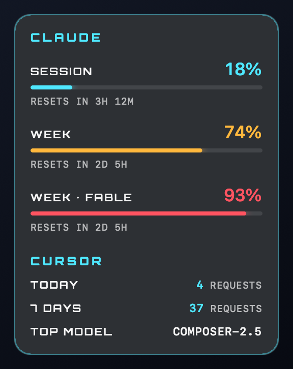

# Claude Cockpit

A small frameless macOS widget that floats above your windows and shows how much of your
Claude plan you have used, plus how much you have been using Cursor's agent.



It shows one meter for each limit that Claude Code's `/usage` command reports — the current
session, the week, and any per-model weekly limit — with the percentage used and the time
left until it resets. If you use [Cursor](https://cursor.com), a second section shows your
agent activity there.

## Requirements

- macOS 14 or later
- Swift 5.9 or later (Xcode, or the Command Line Tools: `xcode-select --install`)
- [Claude Code](https://claude.com/claude-code) installed and signed in with a Claude
  subscription. Check with:

  ```sh
  claude -p "/usage"
  ```

  You should see lines such as `Current session: 18% used · resets …`. If you don't, the
  widget has nothing to show.

## Setup

```sh
git clone https://github.com/ezzio-salas/claude-cockpit.git
cd claude-cockpit
./build.sh
open ClaudeCockpit.app
```

`build.sh` compiles a release build and assembles `ClaudeCockpit.app` in the project folder.
The app is self-contained, so you can move it to `/Applications` afterwards.

To start it when you log in, add `ClaudeCockpit.app` under
**System Settings → General → Login Items & Extensions → Open at Login**.

## Using it

The app has no Dock icon and no menu bar item; the floating card is the whole interface.

| Action | Result |
| --- | --- |
| Drag the card | Moves it. The position is remembered between launches. |
| Click the card | Refreshes now. `SYNC` shows in the header while it reads. |
| Right-click the card | Menu with **Refresh** and **Quit Claude Cockpit**. |

The card stays above other windows on every Space, including full-screen apps, and never
takes keyboard focus.

Usage is re-read every 60 seconds. Bar colors follow the percentage used:

| Used | Color |
| --- | --- |
| below 70% | cyan |
| 70% to 89% | amber |
| 90% and above | red |

### When a read fails

The widget only ever shows numbers it actually read from Claude.

- If it has an earlier reading, it keeps showing it dimmed, with `STALE · 2m` (time since
  the last good read) in the header. The next successful read clears it.
- If it has no reading yet, it shows one of these instead of meters:

| Message | Meaning |
| --- | --- |
| `READING USAGE` | The first read is in progress. |
| `CLAUDE CLI NOT FOUND` | The CLI executable was not found. See [Troubleshooting](#troubleshooting). |
| `TIMED OUT` | The CLI did not answer within 20 seconds. |
| `COULD NOT READ USAGE` | The CLI exited with an error, for example when signed out. |
| `UNRECOGNIZED OUTPUT` | The CLI answered, but without any usage lines. |

## Cursor activity

When Cursor is installed, the card gains a **CURSOR** section:

| Row | Meaning |
| --- | --- |
| `TODAY` | Agent requests since midnight that produced code. |
| `7 DAYS` | The same count over the last seven days. |
| `TOP MODEL` | The model behind the most of those requests in the last seven days. |

These numbers are activity, not a quota. Cursor has no local equivalent of Claude's
`/usage`, so the widget counts requests from the database Cursor keeps on your machine
for attributing code to AI (`~/.cursor/ai-tracking/ai-code-tracking.db`). That has two
consequences:

- Only requests that wrote code are counted. Questions the agent answered without
  editing a file do not appear.
- Only this machine is counted, not other devices or Cursor's web agents.

The section needs no setup and is hidden when that database does not exist. It refreshes
together with the Claude meters.

## Using another Claude profile

By default the widget runs `claude`. To read usage for a different account or config
directory, point it at another command and relaunch:

```sh
defaults write local.claude-cockpit cliCommand claude-work
```

The value is either a command name, found the same way `claude` is (see
[Troubleshooting](#troubleshooting)), or a path to an executable such as
`~/bin/claude-work`. The command receives the same arguments `claude` would.

It has to be an executable file. A shell alias or function will not work, because those
exist only inside an interactive shell. A small wrapper script does the job:

```sh
#!/bin/zsh
# ~/.local/bin/claude-work — Claude Code with a separate config directory
export CLAUDE_CONFIG_DIR="$HOME/.claude-work"
exec "$HOME/.local/bin/claude" "$@"
```

Call `claude` by its full path inside the script (`which claude` shows it), since the
widget does not run it with your shell's `PATH`. Make the script executable with
`chmod +x ~/.local/bin/claude-work`. To go back to the default:

```sh
defaults delete local.claude-cockpit cliCommand
```

## How it works

Every refresh runs the Claude Code CLI without a terminal:

```sh
claude -p "/usage" --no-session-persistence --setting-sources "" --strict-mcp-config
```

The extra flags keep the call light: no session is saved, and your hooks, plugins and MCP
servers are not loaded. The widget parses the `Current …: N% used · resets …` lines from
the output and ignores the rest.

Cursor activity comes from a read-only query of Cursor's local SQLite database, described
under [Cursor activity](#cursor-activity).

The app never reads your credentials and makes no network requests of its own; signing in
to Claude is handled entirely by the CLI, and the Cursor numbers never leave your machine.

## Troubleshooting

**`CLAUDE CLI NOT FOUND`** — Apps started from Finder do not inherit your shell's `PATH`.
The widget looks for the command (`claude` unless you [changed it](#using-another-claude-profile))
in `~/.local/bin`, `/opt/homebrew/bin` and `/usr/local/bin`, then asks a login `zsh`
(`command -v`). Make sure it is in one of those places or on the `PATH` of your login shell.

**macOS asks for permission at launch** — If the app lives on an external drive, macOS
asks whether Claude Cockpit may access files on a removable volume. The first read waits
behind that prompt and can show `TIMED OUT`; answer it, then click the card to refresh.
The app is signed ad hoc, so macOS asks again after each rebuild.

**Seeing why a read failed** — Failures are logged. In `zsh`, call `log` by its full path,
because `log` is also a shell builtin:

```sh
/usr/bin/log show --last 10m --predicate 'subsystem == "local.claude-cockpit"'
```

**The meters disappeared after a Claude Code update** — The widget depends on the wording
of the `/usage` output. If that changes, the widget shows `UNRECOGNIZED OUTPUT` and
`UsageParser` needs updating.

## Development

```sh
swift test                # unit tests for parsing, countdowns, the CLI runner and the Cursor reader
swift run ClaudeCockpit   # run without building the .app bundle
./build.sh                # build ClaudeCockpit.app
```

Run with `swift run`, the widget uses the system monospaced font, because Orbitron is only
bundled into the `.app`.

| Path | Contents |
| --- | --- |
| `Sources/CockpitCore` | Parsing, countdown text, the CLI runner and the Cursor reader. No UI, fully unit-tested. |
| `Sources/ClaudeCockpit` | The AppKit panel and views. |
| `Tests/CockpitCoreTests` | Unit tests. |
| `Resources` | The Orbitron font and its license. |
| `docs/design.md` | The design notes the app was built from. |

## Credits

Labels are set in [Orbitron](https://fonts.google.com/specimen/Orbitron), used under the
SIL Open Font License (`Resources/Orbitron-OFL.txt`).
